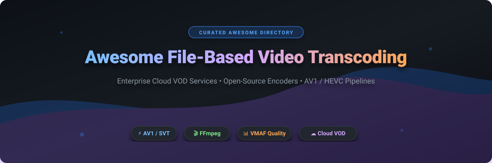

# Awesome-File-Based-Video-Transcoding

# Awesome-File-Based-Video-Transcoding 🎬 📁



  





  
  
  
  
  
  



---

## 🌟 Top File-Based Video Transcoding Ecosystem

**Curated List of Commercial Cloud Encoding Platforms & Open-Source Transcoding Tools**  
*Focused on VOD Encoding, Per-Title Optimization, Codec Efficiency, Hardware Acceleration & Self-Hosted Transcoding Pipelines*

**Last updated: October 2026** 📅

---

### 📌 Overview & SEO Summary
Welcome to the ultimate curated directory of **file-based video transcoding platforms**, **open-source encoding tools**, and **VOD pipeline frameworks**. Whether you are looking for enterprise-grade commercial solutions (such as *AWS Elemental MediaConvert*, *Bitmovin*, and *Dolby.io*), or self-hostable open-source alternatives (like *FFmpeg*, *HandBrake*, and *Av1an*), this list covers category leaders, per-title optimization, and privacy-respecting video processing.

**Key Market Context:**
- **FFmpeg** is the **universal open-source transcoding engine** — every commercial platform builds on it, with **50K+ GitHub stars** and support for **every codec and container**.
- **HandBrake** is the **most widely used open-source transcoder** for file-based workflows, with **18K+ GitHub stars** and **hardware-accelerated encoding**.
- **Av1an** provides **chunked parallel AV1 encoding**, achieving **up to 10x faster encoding** than single-threaded approaches.

---

## 📑 Table of Contents
- [🏢 SaaS & Commercial Platforms](#-saas--commercial-platforms)
- [🔓 Open-Source GitHub Projects](#-open-source-github-projects)
- [🛠️ How to Contribute](#%EF%B8%8F-how-to-contribute)
- [📊 Star History](#-star-history)
- [🤝 Support & Sponsorship](#-support--sponsorship)
- [⚠️ Disclaimer](#%EF%B8%8F-disclaimer)

---

## 🏢 SaaS / Commercial Platforms

The file-based video transcoding market spans **hyperscaler encoding services** (AWS Elemental MediaConvert, Google Transcoder API) that provide **pay-as-you-go encoding at scale**, **specialized encoding platforms** (Bitmovin, Telestream, Qencode) that differentiate through **codec efficiency and per-title optimization**, and **media platforms** (Mux, Cloudinary, Brightcove) that combine **transcoding with delivery and analytics**. **AWS Elemental MediaConvert** charges **$0.042/minute for HD H.264** and **$0.005/minute for audio** . **Bitmovin** charges a **2x premium for HEVC** and **4x for 4K** . **Qencode** charges **$0.005/minute for SD** and **$0.01/minute for HD**, with **AV1 and HEVC delivering 40–60% cost reduction** . **Cloudinary** uses a **credit-based model**: 1 credit = 1,000 transformations, 1 GB storage, or 1 GB bandwidth .

| SaaS / Commercial Platform | Company / Owner | Valuation / Market Cap | Standard Edition Starting Price | Free Tier / Free Trial Limits | Description |
| :--- | :--- | :--- | :--- | :--- | :--- |
| **[AWS Elemental MediaConvert](https://aws.amazon.com/mediaconvert/)** ☁️ | Amazon | ~$2.0 Trillion | **SD H.264: $0.021/min**; **HD: $0.042/min**; **Audio: $0.005/min**  | **Free tier: 20 minutes/month for 12 months**  | **AWS-native professional encoding** — **Pay-as-you-go** with no upfront costs . **Two pricing tiers** (Basic and Professional) with the latter required for **two-pass encoding** . **AWS Elemental** encoding stack with broad format support . |
| **[Bitmovin Cloud Encoding](https://bitmovin.com/)** 🎬 | Bitmovin | Private | **Custom per-minute pricing**; HEVC **2x premium**, 4K **4x**  | **Free trial available** | **Codec efficiency leader** — **Per-Title and Multi-Pass optimization** reduces delivery costs **30–50%** . **AV1 now, VVC evaluation** paths . **Frame-accurate SCTE-35** for SSAI/SGAI monetization . |
| **[Dolby.io Media Processing](https://dolby.io/)** 🔊 | Dolby Laboratories | ~$7 Billion | **Custom per-minute pricing** | **Free trial available** | **Premium media processing** — **Dolby Vision, Dolby Atmos, and Dolby E** support . **Hybrid cloud encoding** with spot instance pricing: **1080p H.264 project: $0.74**; **4K HEVC: $9.26** . |
| **[Telestream Cloud](https://cloud.telestream.net/)** 📡 | Telestream | Private | **Billable minute model**: HD **2x multiplier**, UHD **4x**  | **Pay-as-you-go**, no long-term contracts required | **Media processing suite** — **Vantage workflow ($0.10/job)**, **Tempo ($3.00/min)**, **Tachyon ($0.880/min)** . **Dolby Vision: $0.06–$0.24/min** . **No ingest charges** . |
| **[Brightcove Cloud Transcoding](https://www.brightcove.com/)** 📺 | Brightcove | ~$500 Million | **Zencoder: $0.02–$0.05/min** based on volume  | **Free trial available** | **Video platform with Zencoder** — **2 cents/minute** for monthly plans without commitment, lower for enterprise volume . **Live cloud transcoding** priced using the same Zencoder model . |
| **[Mux Video](https://www.mux.com/)** 🚀 | Mux | Private | **Basic quality: Free encoding**; **Plus/Premium**: per-minute charges  | **Free: 10 assets, 100,000 delivery minutes/month**  | **Developer-first video API** — **Basic quality encoding is free** for simpler use cases . **AI-powered per-title encoding** for Plus/Premium . **Free plan includes Mux Player, Data analytics, captions, 4K support** . |
| **[Cloudinary](https://cloudinary.com/)** ☁️ | Cloudinary | Private | **Credit-based**: 1 credit = 1,000 transformations, 1 GB storage, or 1 GB bandwidth  | **Free: 25 credits/month**  | **Media optimization platform** — **Video transformations counted per second** (resolution-dependent) . **Rolling 30-day window** for usage, not monthly reset . **Add-ons billed separately** (AI Vision, auto-tagging) . |
| **[Fastly Transcoding](https://www.fastly.com/)** 🌐 | Fastly | ~$1 Billion | **CDN: $0.12/GB** (North America, 100 GB–10 TB)  | **100 GB free bandwidth/month**  | **Edge delivery platform** — **Primarily a CDN**, not a full transcoding service . **100 GB free bandwidth** monthly, with volume discounts . **Contact sales for custom transcoding capabilities** . |
| **[Wowza Cloud](https://www.wowza.com/)** 🎥 | Wowza Media Systems | Private | **From $150/month** (usage-based) | **Free trial available** | **Streaming platform for developers** — **Live and VOD streaming with low-latency HLS, WebRTC, and SRT** . **Self-hosted or cloud deployment** . |
| **[Qencode](https://cloud.qencode.com/)** ⚡ | Qencode | Private | **SD: $0.005/min**; **HD: $0.01/min**; **AV1/HEVC: premium tiers**  | **Pay-as-you-go**, no free tier | **Advanced codec encoding** — **AV1 and HEVC** deliver **40–60% cost reduction** through **intelligent parallel processing** . **CDN at $0.017/GB**, storage at **$0.006/GB** . |

---

## 🔓 Open-Source GitHub Projects

*Sorted by GitHub_Stars_Count (Descending)* 🌟

- **[FFmpeg](https://github.com/FFmpeg/FFmpeg)**   
  **The universal multimedia framework**, LGPL-2.1 / GPL-2.0 licensed. **50K+ GitHub stars** — **the foundation of every commercial transcoding platform** . **Decodes, encodes, transcodes, muxes, demuxes, streams, filters, and plays** virtually any media format . **Supports every codec** — H.264, H.265, AV1, VVC, VP9, ProRes, and more . **Hardware acceleration** via NVENC, QSV, VAAPI, and VideoToolbox . **The definitive open-source transcoding engine** — if you are transcoding video, you are using FFmpeg . 🎬

- **[HandBrake](https://github.com/HandBrake/HandBrake)**   
  **The open-source video transcoder**, GPL-2.0 licensed. **18K+ GitHub stars** — **the most widely used file-based transcoder** . **Cross-platform GUI and CLI** for Windows, macOS, and Linux . **Built-in device presets** for iPhone, Android, Apple TV, and more . **Hardware-accelerated encoding** with NVENC, QSV, and VCE . **Batch processing and queue management** . **The most accessible open-source transcoding tool** . 🍹

- **[Av1an](https://github.com/master-of-zen/Av1an)**   
  **Cross-platform command-line AV1 encoding framework**, GPL-3.0 licensed. **4K+ GitHub stars** — **chunked parallel encoding** for **up to 10x faster AV1 encoding** . **Scene detection and chunk splitting** . **Supports aomenc, rav1e, SVT-AV1, and VP9** . **VMAF-based target quality mode** . **The most efficient open-source AV1 encoding pipeline** . 🚀

- **[SVT-AV1](https://github.com/AOMediaCodec/SVT-AV1)**   
  **Scalable Video Technology for AV1 encoder**, BSD-2-Clause licensed. **2K+ GitHub stars** — **the fastest production AV1 encoder** . **Developed by Intel and Netflix** . **Supports 4K/8K real-time encoding** on multi-core CPUs . **The standard AV1 encoder for production pipelines** . ⚡

- **[Video2X](https://github.com/k4yt3x/video2x)**   
  **Lossless video/GIF/image upscaler**, GPL-3.0 licensed. **11K+ GitHub stars** — **uses waifu2x, Anime4K, SRMD, and RealSR** . **Upscales video to 4K and beyond** . **The most popular open-source video upscaler** . 🔍

- **[Jellyfin](https://github.com/jellyfin/jellyfin)**   
  **The Free Software Media System**, GPL-2.0 licensed. **35K+ GitHub stars** — **self-hosted media server with transcoding** . **Transcodes on-the-fly for any device** . **Hardware acceleration with NVENC, QSV, and VAAPI** . **The most popular open-source media server** . 🎞️

- **[Plex Media Server (Open-Source Components)](https://github.com/plexinc)**   
  **Media server with transcoding capabilities**, open-source components. **Transcodes media for any device** . **Hardware acceleration available** . **The most widely deployed media server** . 🎥

- **[Shaka Packager](https://github.com/shaka-project/shaka-packager)**   
  **Media packaging and encryption SDK**, Apache-2.0 licensed. **2K+ GitHub stars** — **packages and encrypts video for DASH, HLS, and CMAF** . **The standard open-source packager for streaming** . 📦

- **[Bento4](https://github.com/axiomatic-systems/Bento4)**   
  **Full-featured MP4 format and DASH/HLS SDK**, GPL-2.0 licensed. **1K+ GitHub stars** — **MP4/DASH/HLS packaging and encryption** . **The most complete open-source MP4 toolkit** . 📐

- **[VMAF](https://github.com/Netflix/vmaf)**   
  **Perceptual video quality assessment**, BSD-2-Clause licensed. **4K+ GitHub stars** — **the industry standard for video quality measurement** . **Used by Netflix for per-title encoding optimization** . **The foundation of quality-aware transcoding** . 📊

- **[GoCoder (Kyoo)](https://github.com/zoriya/kyoo)**   
  **Lazy transcoding with HLS for self-hosted media servers**, open-source. **The transcoder module for Kyoo** . **Lazily transcodes via HLS** with **automatic quality switching** . **Hardware acceleration support**: VAAPI, QSV, CUDA . **The most modern open-source transcoding architecture** . 🎯

---

## 🛠️ How to Contribute

Contributions are welcome! Follow these steps to submit new file-based video transcoding platforms or open-source transcoding software:

1. 🍴 **Fork** the repository.
2. 📝 **Add/edit** entries in `README.md` maintaining table/list structure and formatting.
3. 🔗 Include project title, official website/GitHub link, exact Stars_Count, license, and brief description.
4. 🚀 Submit a **Pull Request** with a descriptive summary of your changes.

---

## 📊 Star History



---

## 🤝 Support & Sponsorship

If you find this file-based video transcoding repository useful, please consider supporting the project:

- ⭐ **Star** this repository to increase visibility!
- 🔀 **Fork** and share with fellow video engineers, streaming developers, and open-source advocates.
- ☕ **Sponsor & Buy Me a Coffee**: Support ongoing open-source curation via the [GitHub Sponsor Dashboard](https://github.com/sponsors/ishandutta2007).

---

## ⚠️ Disclaimer

- This is a **community-curated** list — not exhaustive and not an endorsement. ℹ️
- **FFmpeg is the foundation of every commercial transcoding platform** — **50K+ GitHub stars** and **universal codec support** . **HandBrake is the most accessible file-based transcoder** with **18K+ GitHub stars** .
- **AWS Elemental MediaConvert charges $0.042/minute for HD H.264** . **Qencode charges $0.01/minute for HD** with **AV1/HEVC delivering 40–60% cost reduction** . **Cloudinary uses a credit-based model** with a **rolling 30-day window** .
- **Open-source transcoding tools (FFmpeg, HandBrake, Av1an) are not turnkey** — they require **command-line expertise, pipeline orchestration, and quality validation** . **FFmpeg requires deep codec knowledge** . **Av1an requires AV1 encoder setup** . **Always validate output quality with VMAF or similar metrics** before production deployment . 🎬

---



  <b>Made with ❤️ for video engineers, streaming developers, and open-source transcoding advocates.</b>

